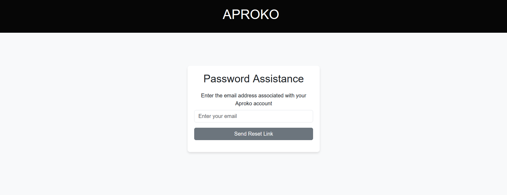

# Aproko Micro Blog

## Overview
This repository contains the implementation of a micro-blogging platform, designed as part of Capstone Project 3. The platform allows users to interact with features such as user authentication, profile management, and blogging functionalities.

## Features
- User authentication (Sign-up, Login, and Logout).
- Editable user profile with persistent data storage.
- Interactive user interface with responsive design.
- Integration of Bootstrap for styling and Font Awesome for icons.
- Dynamic functionalities powered by JavaScript.

## Technologies Used
- **HTML5**: For structuring the web pages.
- **CSS3**: For styling and layout.
- **JavaScript**: For interactivity and dynamic content.
- **Bootstrap**: For responsive design and pre-styled components.
- **Microbloglite**: Provides the endpoint (URLs) for performing operation such fetching messages, liking posts and creating users. 

## File Structure
- `index.html`: Home page.
- `login.html`: Login page.
- `signup.html`: Sign-up page.
- `profile.html`: Profile management page.
- `messages.html`: User messages page.
- `new.html`: Page for creating new messages.
- `css/`: Contains custom CSS files for styling.
- `js/`: Contains JavaScript files for interactivity.
- `images/`: Contains assets such as profile and cover photos.

## How to Use
1. Open the application in your browser.
2. Create a new account on the sign-up page or log in if you already have an account.
3. Navigate through the pages using the navigation bar.
4. Edit your profile, manage your messages, and explore other features.

## Screen Shots 

